# CHƯƠNG 3: THIẾT KẾ HỆ THỐNG

## 3.1 Mô tả bài toán
Tên bài toán: “Xây dựng ứng dụng TKApp - Nền tảng Thương mại điện tử (Ecommerce Multiplatform)”.
Hệ thống TKApp là một nền tảng thương mại điện tử đa nền tảng, cho phép:
- Người dùng truy cập và mua sắm từ nhiều nền tảng khác nhau (web, mobile, tablet, …).
- Kết nối nhiều nhà bán hàng (Seller) với khách hàng.
- Cung cấp trải nghiệm mua sắm liền mạch, trực quan.
- Tích hợp các phương thức thanh toán an toàn, đa dạng.
- Quản lý đơn hàng, vận chuyển, ví điện tử của nhà bán hàng.

## 3.2 Phân tích hệ thống 

### 3.2.1 Yêu cầu chức năng
Sau khi hoàn thiện ứng dụng đã đáp ứng đầy đủ các chức năng:
- **Đối với người dùng (User):**
  - Đăng ký, đăng nhập.
  - Tìm kiếm và xem thông tin sản phẩm (Public Shop, Product Detail).
  - Quản lý danh sách yêu thích (Wishlist).
  - Thêm sản phẩm vào giỏ hàng và thanh toán trực tuyến (Cart, Checkout).
  - Quản lý thông tin cá nhân (Profile).
  - Theo dõi trạng thái lịch sử đơn hàng (Order History).
  - Đánh giá và nhận xét sản phẩm (Review).
  - Nhắn tin trực tiếp với nhà bán hàng (Chat).
- **Đối với nhà bán hàng (Seller):**
  - Xem thống kê cửa hàng (Seller Dashboard).
  - Quản lý danh sách sản phẩm (Add Product, Seller Products).
  - Quản lý hồ sơ cửa hàng (Seller Profile).
  - Quản lý ví điện tử, doanh thu bán hàng và rút tiền (Seller Wallet).
  - Nhắn tin với người mua (Chat).
- **Đối với quản trị viên (Admin):**
  - Đối soát doanh thu và các giao dịch (Admin Reconcile).
  - Thực hiện hoàn tiền cho khách hàng khi có hủy đơn/trả hàng (Admin Refund).
  - Thanh toán tiền từ hệ thống sang ví của người bán (Admin Payout).

### 3.2.2 Yêu cầu phi chức năng
- Hệ thống phải có giao diện thân thiện, dễ sử dụng và trực quan.
- Tốc độ truy cập và xử lý dữ liệu nhanh chóng, ổn định và chính xác.
- Đảm bảo tính bảo mật thông tin người dùng và giao dịch thanh toán.
- Hệ thống có khả năng mở rộng và bảo trì dễ dàng.
- Đảm bảo tính tương thích trên nhiều thiết bị và nền tảng khác nhau.

### 3.2.3 Yêu cầu hệ thống

Hệ thống cần đáp ứng các yêu cầu sau:

Hoạt động ổn định trên các nền tảng:
- Android
- iOS
- Web
Hỗ trợ kết nối Internet và đồng bộ dữ liệu theo thời gian thực.
Đảm bảo khả năng xử lý nhiều người dùng đồng thời.

### 3.2.4 Yêu cầu về ngôn ngữ và thư viện

**Ngôn ngữ lập trình**
- JavaScript
- TypeScript

**Framework và nền tảng phát triển**
- Frontend: React Native (phát triển qua Expo)
- Backend: NodeJS, ExpressJS

**Thư viện và công nghệ hỗ trợ**
- React Context / Hooks dùng để quản lý state.
- Firebase Authentication dùng cho xác thực và phân quyền.
- Firebase (Firestore, Cloud Storage) dùng để lưu trữ dữ liệu và hình ảnh.
- React Navigation dùng cho điều hướng giao diện.
- Stripe API tích hợp thanh toán điện tử trực tuyến.

### 3.2.5 Các tác nhân của hệ thống

| Actor | Chức năng |
| :--- | :--- |
| **User (Người mua)** | Thực hiện tìm kiếm sản phẩm, quản lý Wishlist, đặt hàng, thanh toán, theo dõi đơn hàng, đánh giá sản phẩm và nhắn tin với người bán. |
| **Nhà bán hàng (Seller)** | Quản lý sản phẩm, theo dõi thống kê doanh thu, quản lý ví điện tử, quản lý hồ sơ cửa hàng, và tương tác với người mua qua Chat. |
| **Quản trị viên (Admin)** | Quản lý các luồng tài chính của hệ thống bao gồm: Đối soát giao dịch, thực hiện hoàn tiền (Refund) và thanh toán cho người bán (Payout). |

*Bảng 3.1: Bảng các tác nhân của hệ thống*

### 3.2.6 Các use case

| ID | Tên Usecase | Actor Sử Dụng |
| :--- | :--- | :--- |
| 1 | Xác thực tài khoản (Đăng ký/Đăng nhập) | User, Seller, Admin |
| 2 | Mua sắm (Tìm kiếm, Xem chi tiết, Wishlist) | User |
| 3 | Giỏ hàng và Thanh toán | User |
| 4 | Đơn hàng và Đánh giá | User |
| 5 | Quản lý cửa hàng (Dashboard, Sản phẩm) | Seller |
| 6 | Quản lý Ví điện tử | Seller |
| 7 | Nhắn tin trực tuyến (Chat) | User, Seller |
| 8 | Quản trị tài chính (Đối soát, Hoàn tiền, Payout) | Admin |

*Bảng 3.2: Bảng các use case*

### 3.2.7 Đặc tả use case

**(1) UC Xác thực tài khoản (Đăng ký/Đăng nhập)**
*   **Tác nhân:** User, Seller, Admin
*   **Mục tiêu:** Định danh người dùng vào hệ thống Firebase Auth.
*   **Tiền điều kiện:** Có kết nối mạng.
*   **Hậu điều kiện:** Người dùng lấy được phiên đăng nhập và truy cập vào các màn hình tương ứng với Role của mình.
*   **Các dòng sự kiện chính:** Người dùng mở ứng dụng -> Vào AuthStack -> Chọn Đăng nhập/Đăng ký -> Nhập Email, Password -> Gửi yêu cầu lên Firebase -> Firebase Auth trả về kết quả -> Hệ thống lưu trạng thái và điều hướng đến Home/SellerDashboard/Admin tương ứng.

**(2) UC Mua sắm (Tìm kiếm, Xem chi tiết, Wishlist)**
*   **Tác nhân:** User
*   **Mục tiêu:** Khám phá sản phẩm và lưu lại các sản phẩm yêu thích.
*   **Các dòng sự kiện chính:** User mở màn hình HomeScreen / PublicShopScreen -> Tìm kiếm sản phẩm -> Nhấn vào sản phẩm để mở ProductDetailScreen -> Xem mô tả, hình ảnh -> Có thể nhấn nút thêm vào WishlistScreen.

**(3) UC Giỏ hàng và Thanh toán**
*   **Tác nhân:** User
*   **Mục tiêu:** Xác nhận mua hàng và thanh toán qua Stripe.
*   **Các dòng sự kiện chính:** User thêm sản phẩm từ ProductDetail vào CartScreen -> Mở Cart -> Chọn CheckoutScreen -> Hệ thống tính tổng tiền -> Gọi API tạo Payment Intent (Stripe) -> User nhập thông tin thẻ -> Hoàn tất thanh toán -> Hệ thống tạo đơn hàng trong Firestore.

**(4) UC Đơn hàng và Đánh giá**
*   **Tác nhân:** User
*   **Mục tiêu:** Theo dõi trạng thái đơn đã mua và để lại Review.
*   **Các dòng sự kiện chính:** User mở OrderHistoryScreen -> Xem danh sách đơn -> Với đơn hàng đã nhận, chọn Đánh giá -> Mở ReviewScreen -> Chấm điểm sao và nhập nội dung -> Lưu đánh giá.

**(5) UC Quản lý cửa hàng (Sản phẩm, Dashboard)**
*   **Tác nhân:** Seller
*   **Mục tiêu:** Đăng bán và theo dõi hiệu quả kinh doanh.
*   **Các dòng sự kiện chính:** Seller mở SellerDashboardScreen xem thống kê -> Vào SellerProductsScreen để xem sản phẩm hiện có -> Có thể mở AddProductScreen để tải lên ảnh (Firebase Storage), nhập giá, mô tả và lưu vào Firestore.

**(6) UC Quản lý Ví điện tử (Seller Wallet)**
*   **Tác nhân:** Seller
*   **Mục tiêu:** Xem số dư và yêu cầu rút tiền doanh thu.
*   **Các dòng sự kiện chính:** Seller mở SellerWalletScreen -> Hệ thống truy xuất số dư khả dụng -> Seller chọn tạo yêu cầu rút tiền -> Hệ thống ghi nhận yêu cầu chờ Admin duyệt.

**(7) UC Nhắn tin trực tuyến (Chat)**
*   **Tác nhân:** User, Seller
*   **Mục tiêu:** Trao đổi trực tiếp về sản phẩm, đơn hàng.
*   **Các dòng sự kiện chính:** Từ ProductDetail hoặc Đơn hàng, User chọn nhắn tin -> Mở ChatScreen -> Tin nhắn được lưu và đồng bộ realtime qua Firebase Firestore -> Seller nhận thông báo trong ChatListScreen và phản hồi.

**(8) UC Quản trị tài chính (Đối soát, Hoàn tiền, Payout)**
*   **Tác nhân:** Admin
*   **Mục tiêu:** Điều phối dòng tiền giữa User và Seller.
*   **Các dòng sự kiện chính:** 
    *   **Đối soát:** Mở AdminReconcileScreen kiểm tra các giao dịch Stripe so với đơn hàng.
    *   **Hoàn tiền:** Mở AdminRefundScreen -> Chọn đơn hàng cần hoàn -> Gọi API Refund của Stripe.
    *   **Thanh toán:** Mở AdminPayoutScreen -> Xem danh sách Seller yêu cầu rút tiền -> Thực hiện duyệt và trừ số dư ví của Seller.

---

### 3.2.8 Biểu đồ Use Case

**Hình 3.1: Biểu đồ Usecase Tổng quát Hệ thống TKApp**
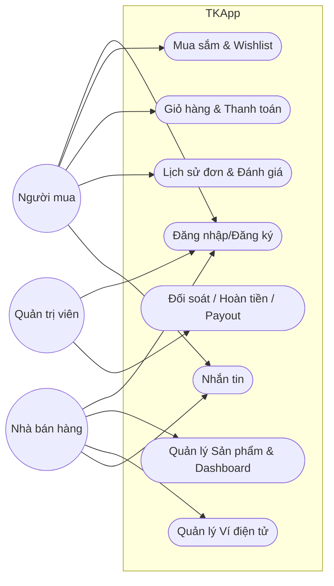

**Hình 3.2: Biểu đồ Usecase Người mua (User)**
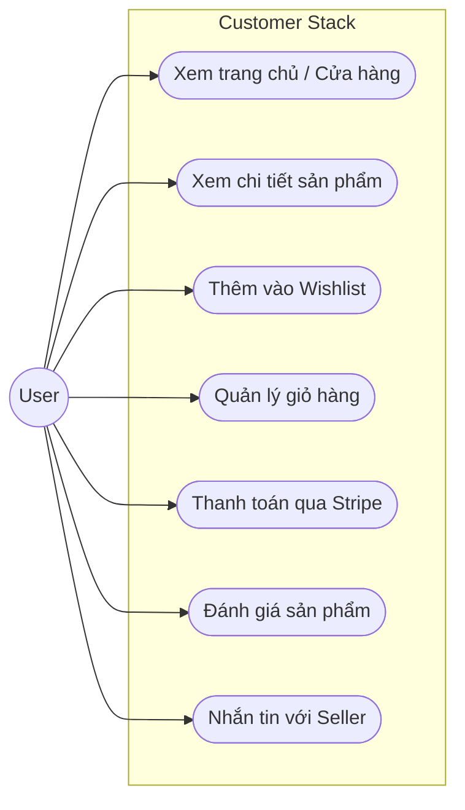

**Hình 3.3: Biểu đồ Usecase Người bán (Seller)**
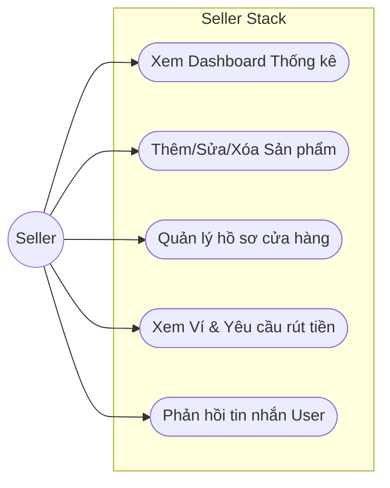

**Hình 3.4: Biểu đồ Usecase Quản trị viên (Admin)**
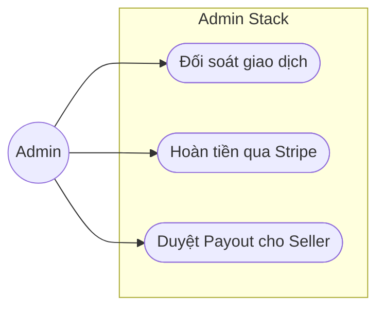

---

### 3.2.9 Biểu đồ tuần tự

**Hình 3.5: Biểu đồ tuần tự Đăng nhập/Đăng ký (Firebase Auth)**
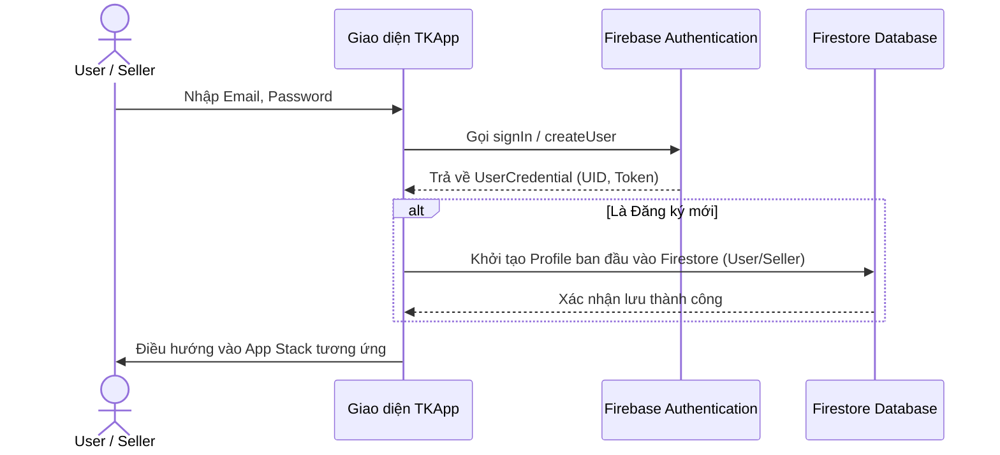

**Hình 3.6: Biểu đồ tuần tự Giỏ hàng và Thanh toán (Stripe)**
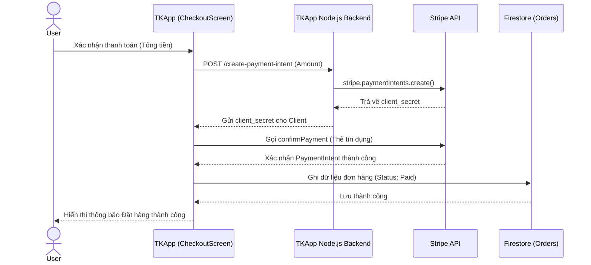

**Hình 3.7: Biểu đồ tuần tự Nhắn tin (Chat)**
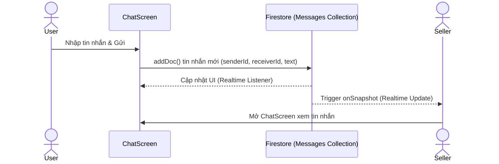

**Hình 3.8: Biểu đồ tuần tự Quản trị Tài chính (Admin Payout)**
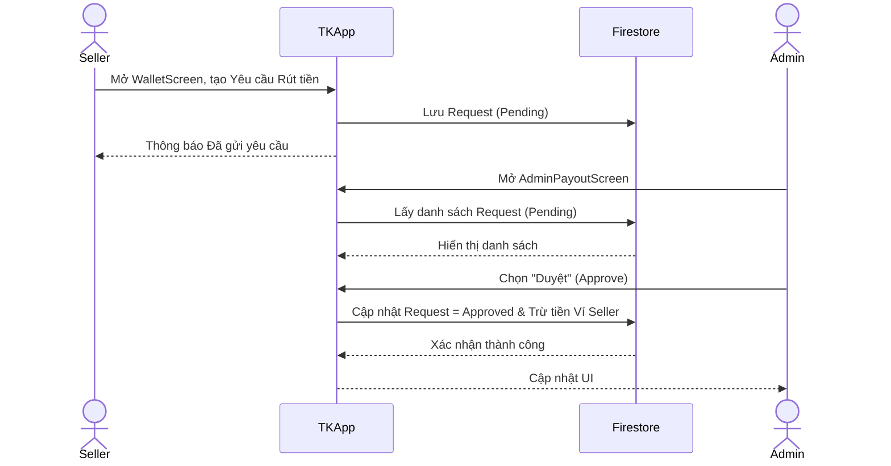

---

### 3.2.10 Biểu đồ hoạt động

**Hình 3.9: Biểu đồ hoạt động Checkout thanh toán**
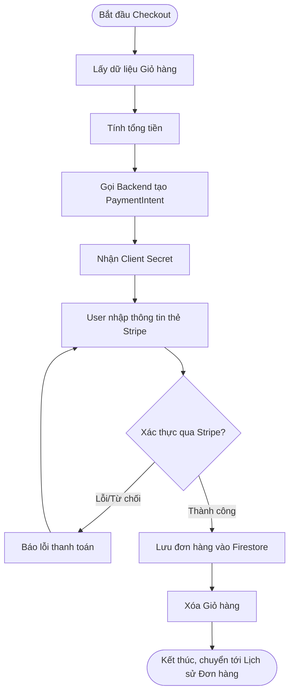

**Hình 3.10: Biểu đồ hoạt động Admin Hoàn tiền (Refund)**
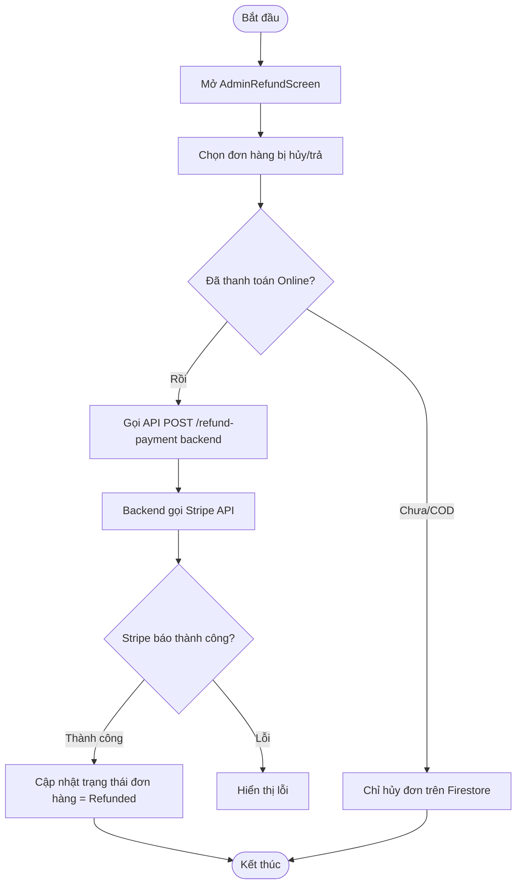

---

### 3.2.11 Biểu đồ phân rã chức năng

**Hình 3.11: Biểu đồ phân rã chức năng TKApp**
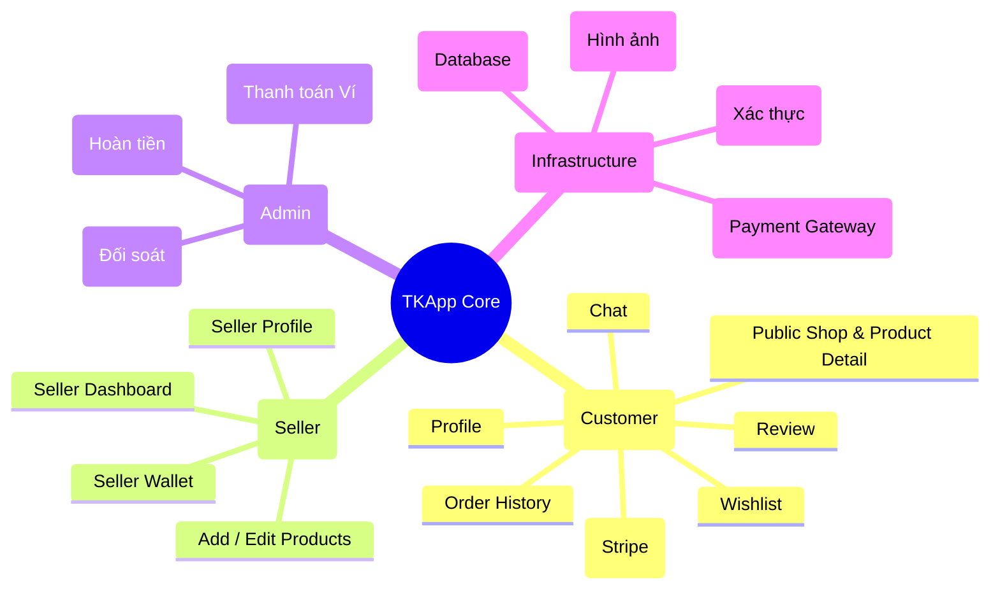
